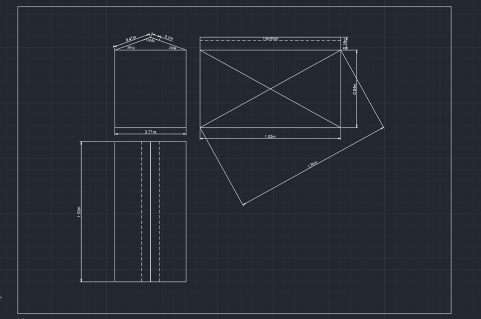

## Description

AgroJason Project, is an automated hydroponic greenhouse which maintains the conditions of humidity, pH, light and temperature. The desirable values are saved in a database. It has 4 separate units, in order to have parallel cultivation. These units are connected to a UI system, so that the system is easily controlled by a user.

## Goals

This project aims to be the template in order to develop and test new technologies in agriculturing, and give an inspiration in hydroponic systems management and telescoping. More specifecily, some technologies we want to develop is:

* AI integration for better understanding of cultivation needs and reduction of labor costs for producers.
* Using IoT for managing the greenhouse from distance.
* Using computer vision for etc. disease prevention.

## Cultivation

The Greenhouse's cultivation is going to be a hydroponic system. The plants (which are presented in the DataBase section) are going to be planted in a stonewool, in order to be easy to change cultivations. This is going to be set in a closed system of irrigation in order to reduce the needed resources and the ground pollution.

## Control Unit

Each unit has its own control unit. It is implemented on Arduino mini board. It has its own sensors in order to get values of:

* Humidity: DHT11
* Substrate humidity: Soil Humidity Hygrometer Moisture Detection Sensor
* Light: Photoresistor
* Temperature :DHT11 (it gets values of temperature and humidity)
* PH :Liquid PH Sensor

So, as we get the condition values, we try to maintain them in the correct sum. In order to achieve this we have installed some mechanisms. Those are:

* A heat radiator system, using a resistor.
* A wet side system.
* Windows.
* A curtain
* A UV light.
* A water container

So let's describe how does it work:

* If the temperature is low, activate the radiator system.
* If the temperature is high, activate the wet side system.
* If the humidity is low, water the plant, using the water container.
* If the humidity is high, open the windows.
* If light is low, turn on the UV light.
* If light is high, close the curtains.
* For pH, we are not ready in this version to force it.

## DataBase

The dataBase is constructed by Mongodb. Connection between the UI and the database is implented via loopback 3.0. Functionalities supported include logging in as user and the related basic features.

In the dataBase, we have the values of:

* Strawberry
* Bean
* Pepper
* Melon
* Tomato
* Eggplant
* Lettuce
* Watermelon
* Gerbera
* Gypsophile
* Clove
* Cucumber

## UI

Angular was employed for the creation of the UI, to enable for easy deployment both as a website or as an application.

## Technical Specs

Each unit has the dimensions described in this picture:

The greenhouse is going to be covered with a PLEXIGLASS.